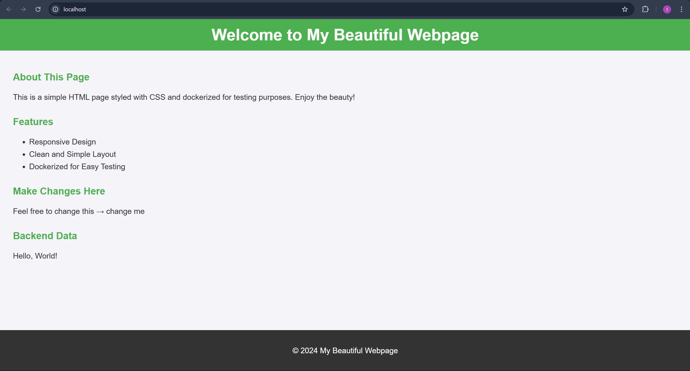

# Docker App for Testing Multi-Container Web Application

## Overview

This repository contains a simple Docker app designed for testing a multi-container web application with a backend and a frontend. The app serves a static HTML page styled with CSS and includes a backend API using Flask. This setup is used to validate the deployment and cleanup functionalities.

## Repository Contents

- **`backend/`**: Contains the backend Flask application.
  - **`app.py`**: The main Flask application file.
  - **`requirements.txt`**: Lists the Python dependencies.
  - **`Dockerfile`**: The Dockerfile used to build the Docker image for the backend application.
- **`frontend/`**: Contains the frontend application.
  - **`index.html`**: The main HTML file that is served by the application.
  - **`style.css`**: The stylesheet that provides basic styling for the HTML content.
  - **`nginx.conf`**: Nginx configuration file for reverse proxy setup.
  - **`Dockerfile`**: The Dockerfile used to build the Docker image for the frontend application.
- **`docker-compose.yml`**: Docker Compose file to run both backend and frontend services.

## Testing the Multi-Container App

To test the multi-container web application using this Docker setup, follow these steps:

1. **Clone the Repository**:
   - Clone the repository where the app is located:

     ```bash
     git clone <repository-url>
     cd <repository-directory>
     ```

2. **Create a New Branch**:
   - Create a new branch to make minor changes:

     ```bash
     git checkout -b test-deployment
     ```

3. **Make Changes**:
   - Make noticeable changes to the `index.html` or `style.css` file in the `frontend` directory. For example, update the text in the HTML file or modify the styling in the CSS file.

4. **Push the Changes**:
   - Push the changes to the remote repository:

     ```bash
     git add .
     git commit -m "Test deployment changes"
     git push origin test-deployment
     ```

5. **Create a Pull Request**:
   - Open a pull request from the `test-deployment` branch to the `main` branch in your GitHub repository. This will trigger the deployment process.

6. **Verify Deployment**:
   - The deployment process will provide a link to the deployed application. Visit this link to check if the deployment was successful and verify that the changes you made are reflected.

## Cleanup Process

After the deployment is successful, the following cleanup process is executed when the pull request is closed, regardless of whether it is merged or not:

1. **Pull Request Closure**:
   - Close the pull request either by merging it or by closing it without merging.

2. **Automatic Cleanup**:
   - The cleanup process will automatically remove the Docker containers and any associated resources from the deployment.

3. **Notification**:
   - A notification will be provided confirming that the cleanup was successful.

## Example

This image shows the appearance of the `index.html` page on the main branch.



## Conclusion

By following these steps, you can ensure that the deployment process effectively manages both the frontend and backend applications, and maintains a clean deployment environment.
